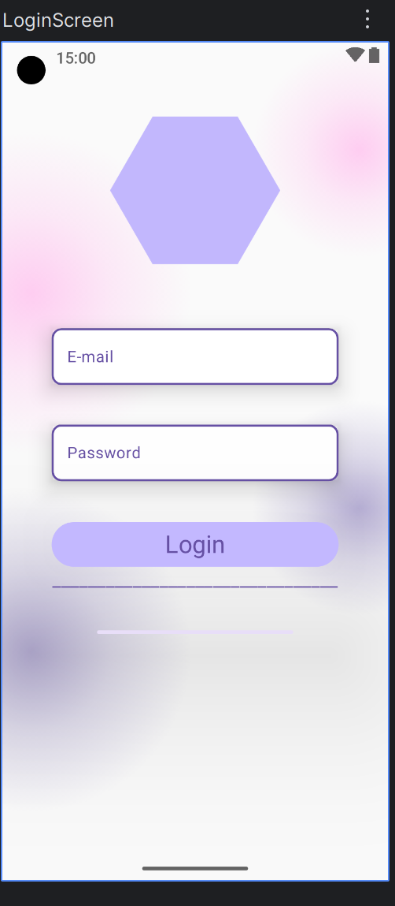

# 🌸 Pastel-Themed Login Screen with Jetpack Compose

A dreamy, gradient-infused login UI designed using **Jetpack Compose**.  
Inspired by modern UI trends, this screen combines soft **radial canvas effects**, elegant **form components**, and smooth **rounded elements** to create a light, welcoming interface perfect for productivity, personal assistants, or self-care apps like **SyAi**.

---

## 📸 Preview

---

## ✨ Features

- 🎨 **Custom Canvas Background** with multiple layered `drawCircle` gradients.
- 🔷 **Hexagon Visual Element** at the top — customizable for logos or profile icons.
- 📬 **Outlined TextFields** with rounded corners and consistent pastel border.
- 🔘 **Fully Rounded Login Button** with soft lavender background and material styling.
- 💜 **Color Palette** based on soft purples, pinks, and subtle whites for a calm aesthetic.

---